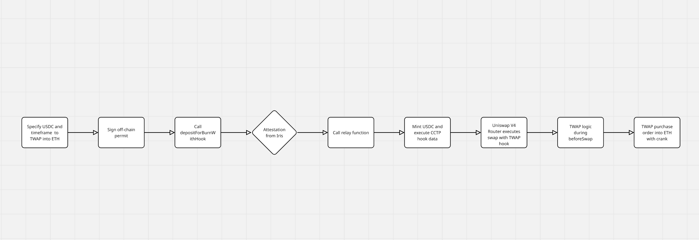

# HooksOnHooks

A cross-chain automated TWAP (Time-Weighted Average Price) solution that enables users to convert USDC to ETH across EVM-compatible blockchains using Circle's CCTP V2 (Cross-Chain Transfer Protocol).

## Overview

HooksOnHooks leverages Circle's CCTP V2 and Uniswap V4's hook system to create a seamless cross-chain TWAP experience. The system allows users to execute automated USDC to ETH conversions across different EVM chains, starting from Ethereum mainnet to Base network, while maintaining price efficiency through TWAP execution.

## Architecture

The system implements a cross-chain TWAP execution through the following technical flow:

1. **Source Chain Initialization**:
   - User specifies USDC amount, TWAP timeframe and destination chain
   - User signs an off-chain permit signature so that the message received on destination chain can spend the bridged USDC

2. **CCTP V2 Integration**:
   - System calls `depositForBurnWithHook` on source chain's CCTP TokenMessenger
   - Hook data contains:
     - TWAP parameters (intervals, amounts)
     - Destination chain Uniswap V4 pool address
     - User's permit signature
   - CCTP burns USDC on source chain
   - Wait for Iris attestation 

3. **Destination Chain Execution**:
   - Call `relay` with message and attestation in a self-deployed CCTPHookWrapper contract on destination
   - USDC is minted on destination chain through CCTP TokenMessenger
   - CCTPHookWrapper executes the hook logic with the minted USDC and allowance from permit signature

4. **Uniswap V4 Integration**:
   - CCTPHookWrapper calls Uniswap V4 Router with hook data
   - Router interacts with USDC-ETH pool
   - Custom TWAP hook is called during `beforeSwap` 

5. **TWAP Execution Logic**:
   - Uniswap V4 pool tracks addresses that execute TWAP intervals
   - Any user interacted with the Uniswap V4 USDC-ETH pool that has this TWAP hook will receive rewards for cranking the TWAP logic (helping other users to execute TWAP periodically)

## Completion Status

Only the components with tick are completed:

✅ 1. Source Chain Initialization  
✅ 2. CCTP V2 Integration  
✅ 3. Destination Chain Execution  
⏳ 4. Uniswap V4 Integration  
⏳ 5. TWAP Execution Logic  
